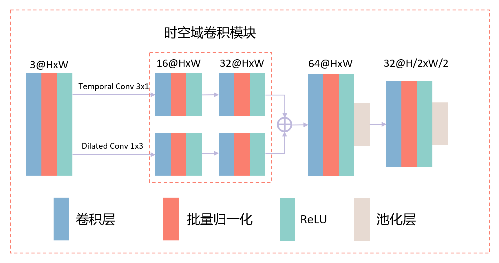

# ViFi: 基于 Wi-Fi 和视觉的多模态行为识别方法研究

## 摘要

人体行为感知在对老年人摔倒行为检测等领域有着举足轻重的作用。传统的非接触式人体行为感知模型只能在一些理想条件下表现良好，但是在特殊场景例如光线变暗或物体遮挡时，其性能通常会显著下降，进一步影响了其泛用性。 

本文提出了 ViFi 多模态感知模型，通过视觉与 Wi-Fi 协同处理来解决特殊场景下的人体动作识别问题。ViFi感知模型使用基于 YOLO 的视觉目标检测预处理与由卷积神经网络和循环神经网络组成的视觉感知模块提取视频摄像头采集的样本特征，通过基于多尺度的时空域卷积网络对 Wi-Fi 的信道状态信息（Channel State Information，CSI）进行特征提取，最后将两种模态的特征采取直接相联的方式融合。 

与先进的 GaitFi^[1] CRNN 模型相比，ViFi 感知模型在视觉模态上提升了 1.56% 至7.81%，Wi-Fi 的感知能力提高幅度在 3.65% 至 11.46% 之间，并在极端场景下的动作识别效果有超过 20% 的提升。此外，实验将多种场景下的数据合并混杂训练，得到了适用于更复杂场景的大型动作识别跨域模型预训练权重，在不同光照度和物体遮挡的场景中取得了较好效果，并且在未经学习过的新场景下也实现了 86.98% 的识别准确率。实验证明感知模型具有了更先进的识别效果和更高的鲁棒性和泛用性，未来可以被应用在智能家居、安防监控、数字娱乐等领域。


## 实验环境

* Pytorch 2.0.1
* CUDA 11.8
* Nvidia 3070Ti / 3070 / Titan Xp

## 模型


### 视觉模型


CNN + RNN

### Wi-Fi 模型



基于多尺度的时空域卷积网络^[2]

## 训练

按照使用顺序依次是：

1. `utils/collect_datasets.py` (LRM)
2. `utils/dataset_divider.py` (数据集分割)
3. `utils/same_filename.py` (数据集重命名等工具)
4. `utils/preprocess.py -> ./yolov5/detect.py` (基于YOLO的视觉目标检测数据预处理)
5. `python3 train.py --input_type both/image/mat` (根据数据类型修改类型训练)
6. `python3 test.py --input_type both/image/mat` (根据数据类型修改类型测试)

已经规范好的数据集路径样例 `datasets/light/10/train/crop/clap/hb-2-2-4-1-3-c01/`

即 `datasets + working + train/test + 模态类型 + 动作 + 采集者及编号`

代码中以 `working` 指代目前正在使用的数据集，样例

```python
working: str = f'occlusion/cabinet'
```

可直接对其修改使用

## 结果

见 `result.xlsx`

---

[1]: GaitFi: Robust Device-Free Human Identification via WiFi and Vision Multimodal Learning [Link](https://doi.org/10.48550/arXiv.2208.14326)

```
@ARTICLE{9887951,
  author={Deng, Lang and Yang, Jianfei and Yuan, Shenghai and Zou, Han and Lu, Chris Xiaoxuan and Xie, Lihua},
  journal={IEEE Internet of Things Journal}, 
  title={GaitFi: Robust Device-Free Human Identification via WiFi and Vision Multimodal Learning}, 
  year={2022},
  publisher={IEEE},
  doi={10.1109/JIOT.2022.3203559}}
```

[2]: Towards WiFi-based Real-time Sensing Model Deployed on Low-power Devices [Link](https://ieeexplore.ieee.org/abstract/document/9973514)

```
@inproceedings{lu2022towards,
  title={Towards WiFi-based Real-time Sensing Model Deployed on Low-power Devices},
  author={Lu, Xinxin and Wang, Lei and Tian, Yuan and Hu, Jiayi and Pan, Yuhao and Zhang, Enze and Zhang, Yichi},
  booktitle={2022 IEEE 19th International Conference on Mobile Ad Hoc and Smart Systems (MASS)},
  pages={385--393},
  year={2022},
  organization={IEEE}
}
```